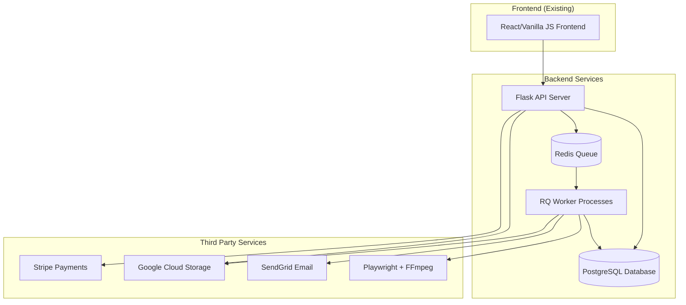
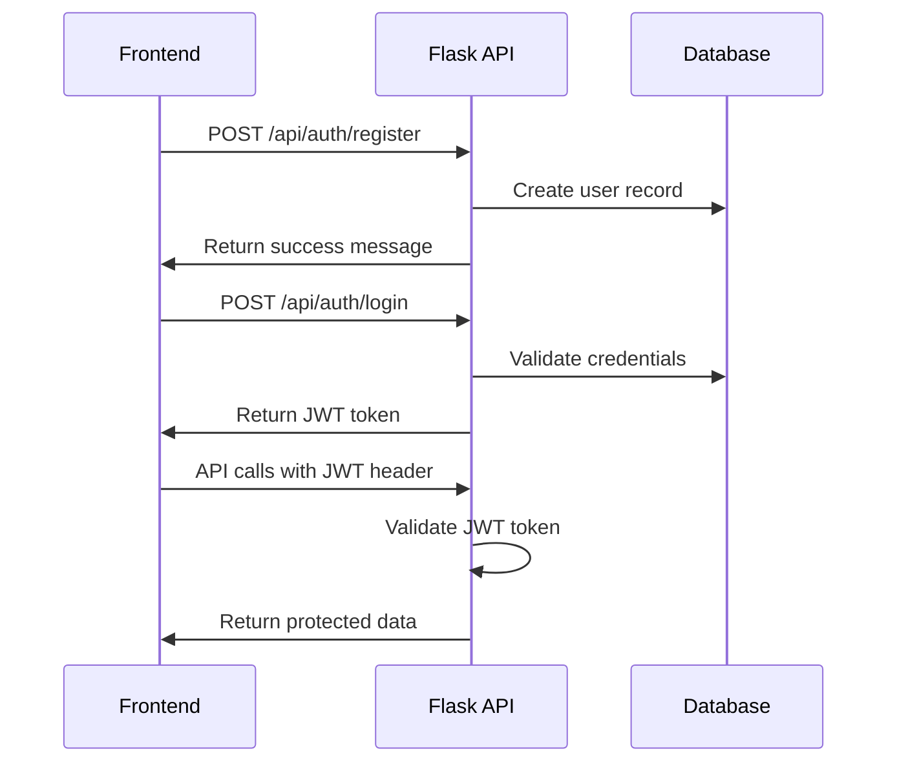
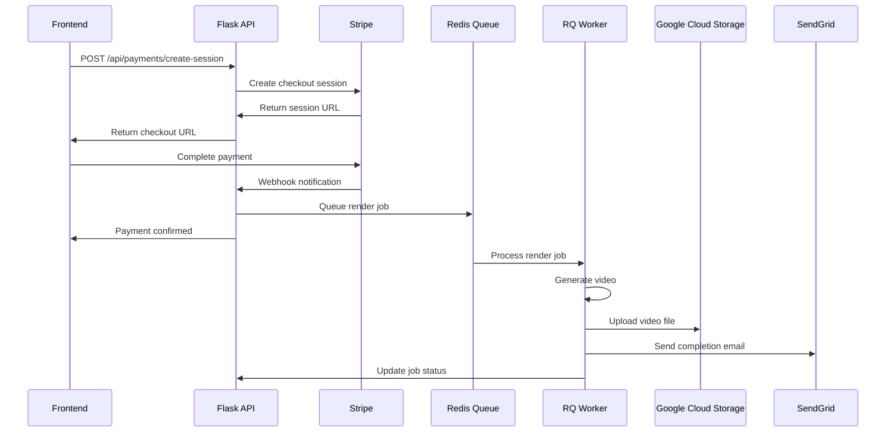

# Design Document

## Overview

The Oriel_Signal_FX_Pro backend is a Flask-based web application that transforms the existing frontend prototype into a commercial audio visualizer service. The system handles user authentication, payment processing, background video rendering, and file delivery through a microservices-oriented architecture deployed on Railway.

The core architecture separates concerns into distinct layers: a main Flask application for API endpoints and user management, a Redis-based job queue system for background processing, worker processes for video rendering, and integrated third-party services for payments, storage, and email delivery.

## Architecture

### System Architecture Diagram



### Deployment Architecture

The system will be deployed on Railway with the following components:

- **Main Application**: Flask API server with Gunicorn
- **Worker Service**: Separate Railway service running RQ workers
- **Redis Service**: Railway Redis addon for job queue
- **PostgreSQL**: Railway PostgreSQL addon for persistent data
- **Static Assets**: Google Cloud Storage for video files

## Components and Interfaces

### 1. Flask API Server (`app.py`)

**Purpose**: Main application server handling HTTP requests, authentication, and API endpoints.

**Key Modules**:
- `auth.py`: JWT-based authentication system
- `payments.py`: Stripe integration for payment processing
- `jobs.py`: Job queue management and status tracking
- `admin.py`: Flask-Admin interface for system management

**Core Endpoints**:
```python
# Authentication
POST /api/auth/register
POST /api/auth/login
POST /api/auth/refresh
POST /api/auth/reset-password

# Payment Processing
POST /api/payments/create-session
POST /api/payments/webhook
GET /api/payments/status/{session_id}

# Video Rendering
POST /api/render/submit
GET /api/render/status/{job_id}
GET /api/render/download/{job_id}

# User Management
GET /api/user/profile
GET /api/user/history
PUT /api/user/profile
```

### 2. Job Queue System (Redis + RQ)

**Purpose**: Manages background video rendering tasks to prevent request timeouts.

**Queue Structure**:
- `high_priority`: Payment confirmations, user notifications
- `video_rendering`: Video processing jobs
- `cleanup`: File cleanup and maintenance tasks

**Job Types**:
```python
@job('video_rendering', timeout='10m')
def render_video_job(job_id, audio_file_path, render_config):
    # Video rendering logic
    pass

@job('high_priority', timeout='30s')
def send_completion_email(user_email, download_url):
    # Email notification logic
    pass
```

### 3. Video Rendering Worker (`worker.py`)

**Purpose**: Background processes that handle video generation using headless browsers and FFmpeg.

**Rendering Pipeline**:
1. **Setup**: Create temporary directory, validate input files
2. **Browser Launch**: Start Playwright with Chromium in headless mode
3. **Page Load**: Load frontend with audio file and render configuration
4. **Recording**: Capture browser tab as video using screen recording
5. **Encoding**: Process raw video with FFmpeg for optimization
6. **Upload**: Store final MP4 in Google Cloud Storage
7. **Notification**: Send completion email with download link
8. **Cleanup**: Remove temporary files and update job status

### 4. Database Models (`models.py`)

**User Model**:
```python
class User(db.Model):
    id = db.Column(db.Integer, primary_key=True)
    email = db.Column(db.String(120), unique=True, nullable=False)
    password_hash = db.Column(db.String(128))
    created_at = db.Column(db.DateTime, default=datetime.utcnow)
    is_active = db.Column(db.Boolean, default=True)
```

**Payment Model**:
```python
class Payment(db.Model):
    id = db.Column(db.Integer, primary_key=True)
    user_id = db.Column(db.Integer, db.ForeignKey('user.id'))
    stripe_session_id = db.Column(db.String(255), unique=True)
    amount = db.Column(db.Integer)  # Amount in cents
    status = db.Column(db.String(50))  # pending, completed, failed
    created_at = db.Column(db.DateTime, default=datetime.utcnow)
```

**RenderJob Model**:
```python
class RenderJob(db.Model):
    id = db.Column(db.Integer, primary_key=True)
    user_id = db.Column(db.Integer, db.ForeignKey('user.id'))
    payment_id = db.Column(db.Integer, db.ForeignKey('payment.id'))
    status = db.Column(db.String(50))  # queued, processing, completed, failed
    audio_filename = db.Column(db.String(255))
    render_config = db.Column(db.JSON)
    video_url = db.Column(db.String(500))
    error_message = db.Column(db.Text)
    created_at = db.Column(db.DateTime, default=datetime.utcnow)
    completed_at = db.Column(db.DateTime)
```

### 5. Configuration Management (`config.py`)

**Environment-based Configuration**:
```python
class Config:
    SECRET_KEY = os.environ.get('SECRET_KEY')
    SQLALCHEMY_DATABASE_URI = os.environ.get('DATABASE_URL')
    REDIS_URL = os.environ.get('REDIS_URL')
    
class DevelopmentConfig(Config):
    DEBUG = True
    STRIPE_PUBLISHABLE_KEY = os.environ.get('STRIPE_TEST_PUBLISHABLE_KEY')
    
class ProductionConfig(Config):
    DEBUG = False
    STRIPE_PUBLISHABLE_KEY = os.environ.get('STRIPE_LIVE_PUBLISHABLE_KEY')
```

## Data Models

### User Authentication Flow



### Payment and Rendering Flow



## Error Handling

### Error Categories and Responses

**Authentication Errors**:
- `401 Unauthorized`: Invalid or expired JWT token
- `403 Forbidden`: Insufficient permissions
- `422 Unprocessable Entity`: Invalid login credentials

**Payment Errors**:
- `400 Bad Request`: Invalid payment parameters
- `402 Payment Required`: Payment not completed
- `409 Conflict`: Duplicate payment session

**Rendering Errors**:
- `413 Payload Too Large`: Audio file exceeds size limit
- `415 Unsupported Media Type`: Invalid audio format
- `500 Internal Server Error`: Rendering pipeline failure

**Error Response Format**:
```json
{
    "error": {
        "code": "INVALID_AUDIO_FORMAT",
        "message": "Audio file must be MP3, WAV, or M4A format",
        "details": {
            "received_format": "flac",
            "supported_formats": ["mp3", "wav", "m4a"]
        }
    }
}
```

### Retry and Recovery Mechanisms

**Job Queue Failures**:
- Automatic retry with exponential backoff (3 attempts)
- Dead letter queue for permanently failed jobs
- Admin notification for critical failures

**External Service Failures**:
- Circuit breaker pattern for Stripe API calls
- Fallback email delivery via backup service
- Graceful degradation for non-critical features

## Testing Strategy

### Unit Testing

**Test Coverage Areas**:
- Authentication logic and JWT token handling
- Payment processing and webhook validation
- Database model operations and relationships
- Video rendering configuration validation

**Testing Framework**: pytest with Flask-Testing extension

**Example Test Structure**:
```python
class TestAuthentication:
    def test_user_registration_success(self):
        # Test successful user registration
        pass
    
    def test_user_login_invalid_credentials(self):
        # Test login with wrong password
        pass
    
    def test_jwt_token_validation(self):
        # Test JWT token creation and validation
        pass
```

### Integration Testing

**API Endpoint Testing**:
- Full request/response cycle testing
- Database transaction testing
- Third-party service integration testing

**Job Queue Testing**:
- Job enqueueing and processing
- Worker failure scenarios
- Queue monitoring and metrics

### End-to-End Testing

**User Journey Testing**:
1. User registration and login
2. Payment processing workflow
3. Video rendering and delivery
4. Download link access and expiration

**Performance Testing**:
- Concurrent user load testing
- Video rendering performance benchmarks
- Database query optimization validation

### Testing Environment Setup

**Test Database**: Separate PostgreSQL instance for testing
**Mock Services**: Stripe test mode, mock email service
**Test Data**: Fixtures for users, payments, and render jobs
**CI/CD Integration**: Automated testing on Railway deployment