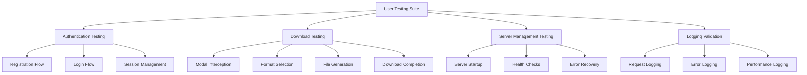

# Design Document

## Overview

This design outlines a comprehensive approach to user experience testing and refinement for the Oriel Signal FX Pro application. The focus is on validating and improving core user flows: account creation, authentication, media downloads (especially MP4/MOV formats), and development experience through enhanced logging. The design emphasizes systematic testing, clear feedback mechanisms, and robust error handling.

## Architecture

### Testing Framework Architecture



### System Integration Points

1. **Frontend Testing Interface**: Interactive test runner with visual feedback
2. **Backend Validation**: API endpoint testing and response validation
3. **File System Integration**: Download verification and file integrity checks
4. **Logging System**: Centralized logging with structured output
5. **Error Handling**: Comprehensive error capture and user feedback

## Components and Interfaces

### 1. User Testing Dashboard

**Purpose**: Central interface for running and monitoring all user experience tests

**Key Features**:
- Test suite selection and execution
- Real-time progress tracking
- Results visualization
- Error reporting and debugging tools

**Interface**:
```javascript
class UserTestingDashboard {
    constructor(config) {
        this.testSuites = [];
        this.currentTest = null;
        this.results = [];
    }
    
    async runTestSuite(suiteName) {
        // Execute specific test suite
    }
    
    displayResults(results) {
        // Show test results with pass/fail status
    }
    
    generateReport() {
        // Create comprehensive test report
    }
}
```

### 2. Authentication Testing Module

**Purpose**: Validate user registration, login, and session management flows

**Key Features**:
- Automated form filling and submission
- Error message validation
- Session persistence testing
- Cross-browser compatibility checks

**Interface**:
```javascript
class AuthenticationTester {
    async testRegistration(userData) {
        // Test account creation flow
    }
    
    async testLogin(credentials) {
        // Test login process
    }
    
    async testSessionPersistence() {
        // Validate session management
    }
    
    validateErrorMessages(errors) {
        // Check error message clarity and accuracy
    }
}
```

### 3. Download Testing Module

**Purpose**: Comprehensive testing of download modal and file generation

**Key Features**:
- Modal interception validation
- Format-specific download testing
- File integrity verification
- Progress tracking validation

**Interface**:
```javascript
class DownloadTester {
    async testModalInterception() {
        // Verify download button interception
    }
    
    async testFormatDownload(format) {
        // Test specific format downloads (MP4, MOV, etc.)
    }
    
    async validateFileIntegrity(filePath) {
        // Check downloaded file quality and format
    }
    
    async testProgressIndicators() {
        // Validate progress feedback during generation
    }
}
```

### 4. Server Management Testing

**Purpose**: Validate server startup, health checks, and error recovery

**Key Features**:
- Automated server restart testing
- Health endpoint validation
- Error recovery testing
- Performance monitoring

**Interface**:
```javascript
class ServerTester {
    async testServerStartup() {
        // Validate server initialization
    }
    
    async testHealthEndpoints() {
        // Check server health and connectivity
    }
    
    async testErrorRecovery() {
        // Validate error handling and recovery
    }
    
    monitorPerformance() {
        // Track server performance metrics
    }
}
```

### 5. Enhanced Logging System

**Purpose**: Provide clear, structured logging for development and debugging

**Key Features**:
- Structured log formatting
- Log level management
- Real-time log streaming
- Error correlation and tracking

**Interface**:
```javascript
class EnhancedLogger {
    constructor(config) {
        this.logLevel = config.level;
        this.formatters = config.formatters;
    }
    
    logRequest(method, endpoint, status) {
        // Log API requests with context
    }
    
    logError(error, context) {
        // Log errors with full context
    }
    
    logUserAction(action, userId, details) {
        // Log user interactions
    }
    
    formatLogEntry(entry) {
        // Apply consistent formatting
    }
}
```

## Data Models

### Test Result Model
```javascript
{
    testId: "string",
    testName: "string",
    status: "passed" | "failed" | "skipped",
    startTime: "timestamp",
    endTime: "timestamp",
    duration: "number",
    errors: [
        {
            message: "string",
            stack: "string",
            context: "object"
        }
    ],
    screenshots: ["string"],
    logs: ["string"]
}
```

### User Flow Model
```javascript
{
    flowId: "string",
    flowName: "string",
    steps: [
        {
            stepId: "string",
            action: "string",
            expectedResult: "string",
            actualResult: "string",
            status: "passed" | "failed",
            screenshot: "string"
        }
    ],
    overallStatus: "passed" | "failed",
    executionTime: "number"
}
```

### Download Test Model
```javascript
{
    downloadId: "string",
    format: "mp3" | "mp4" | "mov" | "gif",
    fileSize: "number",
    generationTime: "number",
    downloadTime: "number",
    integrity: "boolean",
    quality: {
        resolution: "string",
        bitrate: "number",
        codec: "string"
    },
    errors: ["string"]
}
```

## Error Handling

### Error Categories

1. **User Interface Errors**
   - Form validation failures
   - Modal display issues
   - Button interaction problems
   - Navigation errors

2. **Authentication Errors**
   - Registration failures
   - Login credential issues
   - Session timeout problems
   - Permission errors

3. **Download Errors**
   - File generation failures
   - Format conversion issues
   - Network download problems
   - File corruption errors

4. **Server Errors**
   - Startup failures
   - API endpoint errors
   - Database connection issues
   - Resource exhaustion

### Error Handling Strategy

```javascript
class ErrorHandler {
    handleUIError(error, context) {
        // Log error and show user-friendly message
        this.logger.logError(error, context);
        this.showUserMessage(this.formatUserMessage(error));
    }
    
    handleAuthError(error, context) {
        // Handle authentication-specific errors
        if (error.type === 'session_expired') {
            this.redirectToLogin();
        } else {
            this.showAuthError(error.message);
        }
    }
    
    handleDownloadError(error, context) {
        // Handle download-specific errors
        this.logger.logError(error, context);
        this.showRetryOption(context.downloadId);
    }
    
    handleServerError(error, context) {
        // Handle server-related errors
        this.logger.logError(error, context);
        this.checkServerHealth();
    }
}
```

## Testing Strategy

### Test Execution Flow

1. **Pre-Test Setup**
   - Server health verification
   - Database state preparation
   - Test data initialization
   - Browser environment setup

2. **Test Execution**
   - Sequential test suite execution
   - Real-time result capture
   - Screenshot generation for failures
   - Log collection and correlation

3. **Post-Test Analysis**
   - Result aggregation
   - Error pattern analysis
   - Performance metric calculation
   - Report generation

### Test Categories

#### 1. Smoke Tests
- Basic server connectivity
- Essential page loading
- Core functionality availability

#### 2. Functional Tests
- Complete user registration flow
- Full login process
- Download modal functionality
- File generation and download

#### 3. Integration Tests
- Frontend-backend communication
- Database operations
- File system interactions
- Third-party service integration

#### 4. User Experience Tests
- Form usability
- Error message clarity
- Loading indicator effectiveness
- Overall workflow smoothness

### Automated Test Scenarios

```javascript
const testScenarios = {
    registration: [
        'successful_registration_with_valid_data',
        'registration_with_duplicate_email',
        'registration_with_invalid_email_format',
        'registration_with_weak_password',
        'registration_form_validation'
    ],
    
    login: [
        'successful_login_with_valid_credentials',
        'login_with_invalid_credentials',
        'login_with_non_existent_user',
        'session_persistence_after_refresh',
        'automatic_logout_after_timeout'
    ],
    
    downloads: [
        'download_modal_interception',
        'mp4_download_generation',
        'mov_download_generation',
        'download_progress_indication',
        'download_error_handling'
    ],
    
    logging: [
        'request_logging_accuracy',
        'error_logging_completeness',
        'log_formatting_consistency',
        'performance_metric_capture'
    ]
};
```

## Implementation Approach

### Phase 1: Test Infrastructure Setup
- Create test runner framework
- Implement logging enhancements
- Set up error handling mechanisms
- Prepare test data and fixtures

### Phase 2: Core Flow Testing
- Implement authentication testing
- Create download functionality tests
- Develop server management tests
- Build result reporting system

### Phase 3: User Experience Validation
- Execute comprehensive test suites
- Analyze results and identify issues
- Implement fixes and improvements
- Validate fixes through re-testing

### Phase 4: Documentation and Optimization
- Generate comprehensive test reports
- Document identified issues and solutions
- Optimize performance based on findings
- Create maintenance procedures

## Success Metrics

### Functional Metrics
- 100% of critical user flows pass testing
- Download success rate > 95% for all formats
- Authentication success rate > 99%
- Server startup success rate > 99%

### Performance Metrics
- Page load time < 3 seconds
- File generation time < 30 seconds for standard files
- API response time < 500ms for standard requests
- Server startup time < 60 seconds

### User Experience Metrics
- Error message clarity score > 8/10
- User flow completion rate > 90%
- Support ticket reduction > 50%
- User satisfaction score > 4/5

This design provides a comprehensive framework for systematic user experience testing and refinement, ensuring all critical user flows work reliably and provide excellent user experience.